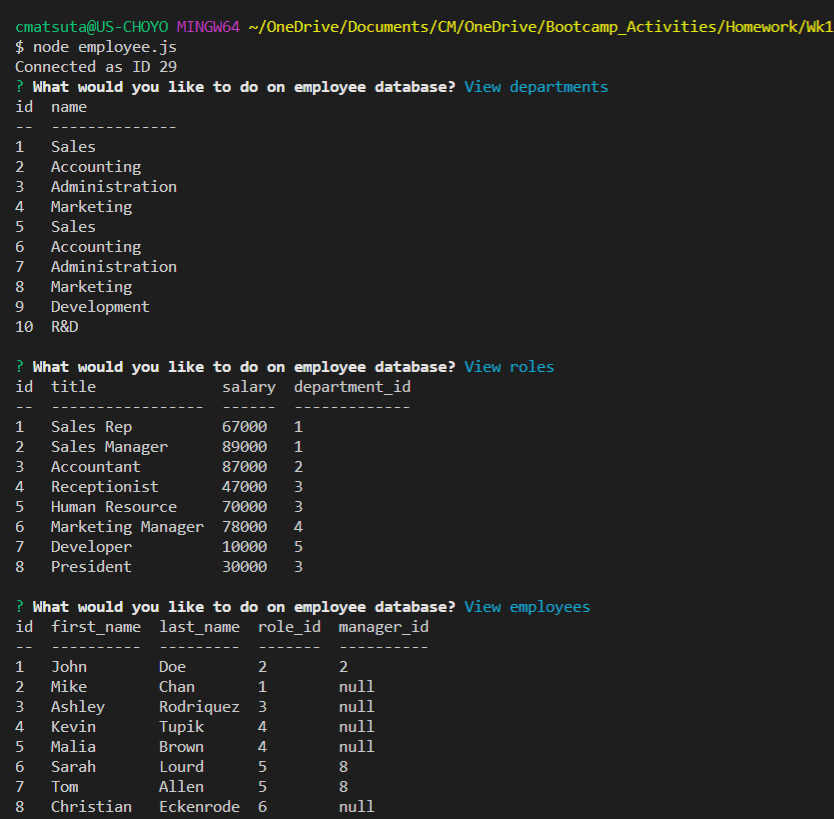
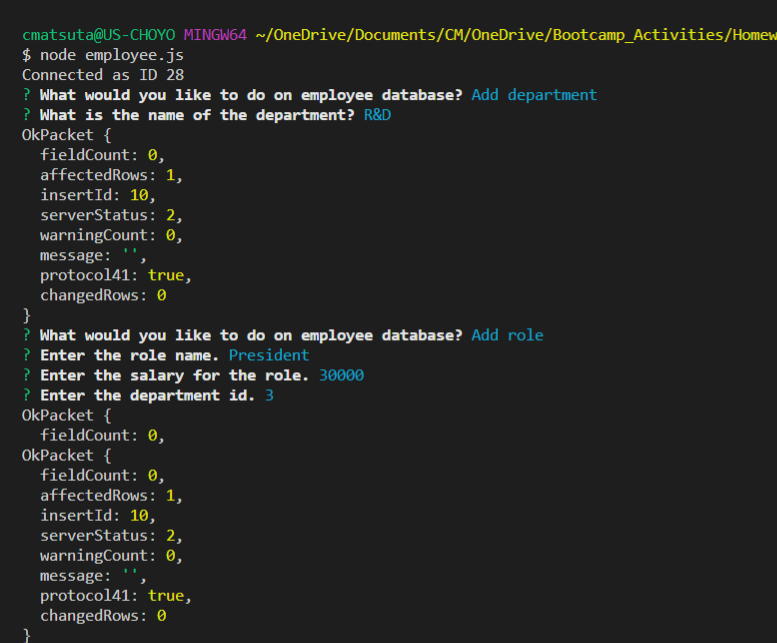

# Employee Tracker

Architect and build a solution for managing a company's employees using node, inquirer, and MySQL.

## Link to deployed app
[Employee Tracker demo video](https://drive.google.com/file/d/1Is8NU8aDdv-OGhBxYs70gBiSeHsoEr0q/view)

## App Description
Built a command-line application that at a minimum allows the user to:

  * Add departments, roles, employees

  * View departments, roles, employees

  * Update employee roles




## Installation
Run `npm i`
Installed npm package: `mysql`, `console.table`,`inquirer`

## Usage

```
As a business owner
I want to be able to view and manage the departments, roles, and employees in my company
So that I can organize and plan my business
```

* The command-line application should allow users to:

  * Add departments, roles, employees

  * View departments, roles, employees

  * Update employee roles

## Contact Information
Choyo Matsuta: [GitHub link](https://github.com/cmatsuta)

### Released under MIT License
Copyright <2020> Choyo Matsuta


Permission is hereby granted, free of charge, to any person obtaining a copy of this software and associated documentation files (the "Software"), to deal in the Software without restriction, including without limitation the rights to use, copy, modify, merge, publish, distribute, sublicense, and/or sell copies of the Software, and to permit persons to whom the Software is furnished to do so, subject to the following conditions:

The above copyright notice and this permission notice shall be included in all copies or substantial portions of the Software.

THE SOFTWARE IS PROVIDED "AS IS", WITHOUT WARRANTY OF ANY KIND, EXPRESS OR IMPLIED, INCLUDING BUT NOT LIMITED TO THE WARRANTIES OF MERCHANTABILITY, FITNESS FOR A PARTICULAR PURPOSE AND NONINFRINGEMENT. IN NO EVENT SHALL THE AUTHORS OR COPYRIGHT HOLDERS BE LIABLE FOR ANY CLAIM, DAMAGES OR OTHER LIABILITY, WHETHER IN AN ACTION OF CONTRACT, TORT OR OTHERWISE, ARISING FROM, OUT OF OR IN CONNECTION WITH THE SOFTWARE OR THE USE OR OTHER DEALINGS IN THE SOFTWARE.